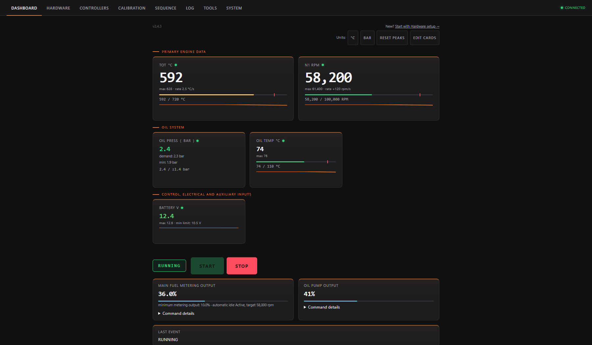

<h1 align="center">OpenTurbine</h1>

OpenTurbine 2.4.3 — open-source ESP32 turbine ECU with guided Windows setup and a browser-based dashboard.

  <a href="https://github.com/elia179/OpenTurbine-ESP32-Gas-Turbine-ECU/releases/latest/download/OpenTurbineSetupTool.exe"><strong>Download for Windows</strong></a>
  &middot; <a href="https://elia179.github.io/OpenTurbine-ESP32-Gas-Turbine-ECU/get-started/">Get Started</a>
  &middot; <a href="https://elia179.github.io/OpenTurbine-ESP32-Gas-Turbine-ECU/hardware/">Hardware guide</a>
  &middot; <a href="docs/README.md">Developer documentation</a>

## What is OpenTurbine?

OpenTurbine is experimental open-source turbine engine controller software for turbojets, APUs, generators, turboshafts, turboprops, and other small turbine systems. It runs on supported ESP32 boards and provides configurable startup and shutdown sequences, output-oriented controllers, fuel and oil control, monitoring, fault handling, calibration, logging, and a browser-based interface.

The normal Windows installation does not require Git, PlatformIO, or source-code compilation.

### Current interface highlights

- Installed-channel inventory for fitted sensors, switches, relays, PWM outputs, and servo/ESC outputs
- Automatic shared-I²C discovery for TCA9554 digital I/O, TLA2528 analog inputs, and NAU7802 torque/thrust load cells
- One shared SPI setup for MAX6675/MAX31855/MAX31856 thermocouple interfaces, plus native OneWire DS18B20 support
- Optional flash-time PCB profiles that replace raw GPIO setup with board-labelled, capability-filtered connections
- Per-pump oil-flow monitoring, electric drain-valve sequencing/controllers, and calibrated torque/thrust measurement
- Simple and rate-predictive gradual fuel limiting for N1, N2, TOT/TIT, P1, P2, and torque, backed by independent hard trips
- A consistent, theme-aware interface across Hardware, Controllers, System, Calibration, Sequence, Log, and Tools, while the live Dashboard stays compact
- Dedicated Controllers and System workspaces that open on the configured system, with Explore all features and Changed views
- Startup, shutdown, afterburner, and custom sequence blocks with final-state previews
- Simple threshold/hysteresis and direct input-to-variable-output controls on Controllers
- Guided calibration, standby-only actuator tests, stable live ECU loop diagnostics, complete engine-file backup/restore, event logs, and per-run session data

The setup flow is **Hardware → Controllers → System → Calibration → Sequence → Tools → Dashboard**. Hardware says what physically exists; Controllers shows what owns each output; System contains ECU-wide runtime and communications settings; Sequence owns ordered transitions.

## What you need

- A Windows computer and data-capable USB cable
- A supported ESP32 board
- A browser-capable phone or computer for the dashboard
- Suitable driver electronics, sensors, power protection, and fusing
- A verified independent physical fuel/power stop and restrained test equipment

## Start with a new board

1. Connect a supported ESP32 board using a USB data cable.
2. [Download OpenTurbine Setup Tool](https://github.com/elia179/OpenTurbine-ESP32-Gas-Turbine-ECU/releases/latest/download/OpenTurbineSetupTool.exe).
3. Choose **Clean install / reinstall** for a blank board, or **Update and keep my setup** for a working controller.
4. For a clean install, choose **Development board**, a compatible bundled **Official OpenTurbine PCB**, or a chip-matched **Custom PCB profile** supplied with the PCB design.
5. Follow the Setup Tool, then join the board Wi-Fi and open the address it shows (normally `http://192.168.4.1`).

Keep only one OpenTurbine browser tab open at a time. This applies to both
Classic ESP32 and ESP32-S3 ECUs; close an old dashboard tab before opening the
panel in another tab, window, browser, phone, or computer.

If Windows warns about the Setup Tool, confirm that you used the official link above. Choose **More info → Run anyway** when Windows offers it. Do not disable Windows security or use an installer from another website. Normal installation does not require understanding or checking file hashes; [advanced verification](docs/WINDOWS_FLASHER_INSTALL.md#optional-advanced-checksum-verification) is optional.

## Supported targets

| Target | Status |
| --- | --- |
| Classic ESP32 with at least 4 MB flash | Supported |
| ESP32-S3 DevKitC-1-compatible board with at least 8 MB flash | Supported; the universal image runs on 8 MB and 16 MB modules without requiring PSRAM |
| Windows guided setup | Supported |
| macOS/Linux graphical installer | Not currently available |
| Manual source build | Advanced/developer path |
| Certified use | Not certified |

> **Experimental engine-control software:** Verify all limits, outputs, shutdown paths, and sequences on a restrained test setup. Use an independent physical fuel/power stop. OpenTurbine does not make an engine safe or replace suitable drivers, fusing, sensors, or operating judgment.

## Before introducing fuel

Configure only the hardware you actually fitted, then verify inputs, limits, calibration, sequences, and individual outputs with fuel and ignition made safe. Run complete dry sequences and verify every stop path before planning a controlled fueled test.

## Documentation

- [Public landing site](https://elia179.github.io/OpenTurbine-ESP32-Gas-Turbine-ECU/)
- [Get started](https://elia179.github.io/OpenTurbine-ESP32-Gas-Turbine-ECU/get-started/)
- [Hardware guide](https://elia179.github.io/OpenTurbine-ESP32-Gas-Turbine-ECU/hardware/)
- [User guide](https://elia179.github.io/OpenTurbine-ESP32-Gas-Turbine-ECU/user-guide/) ([source document](docs/USER_GUIDE.md))
- [Moving from a pre-2.0 build](docs/V2_MIGRATION.md)
- [Troubleshooting](https://elia179.github.io/OpenTurbine-ESP32-Gas-Turbine-ECU/troubleshooting/)
- [Safety](https://elia179.github.io/OpenTurbine-ESP32-Gas-Turbine-ECU/safety/)
- [Developer documentation](docs/README.md)
- [PCB profile authoring](pcb_profiles/README.md)

## Help and status

Use [Setup Help](https://github.com/elia179/OpenTurbine-ESP32-Gas-Turbine-ECU/issues/new?template=setup_help.yml) for Windows, installation, USB, Wi-Fi, and dashboard issues. Use [Bug reports](https://github.com/elia179/OpenTurbine-ESP32-Gas-Turbine-ECU/issues/new?template=bug_report.yml) only for reproducible software behavior, and [Discussions](https://github.com/elia179/OpenTurbine-ESP32-Gas-Turbine-ECU/discussions) for hardware and wiring questions.

OpenTurbine is experimental, not a certified engine-control system. Contributions are welcome; read the developer documentation before building source. Released under the [MIT License](LICENSE).
