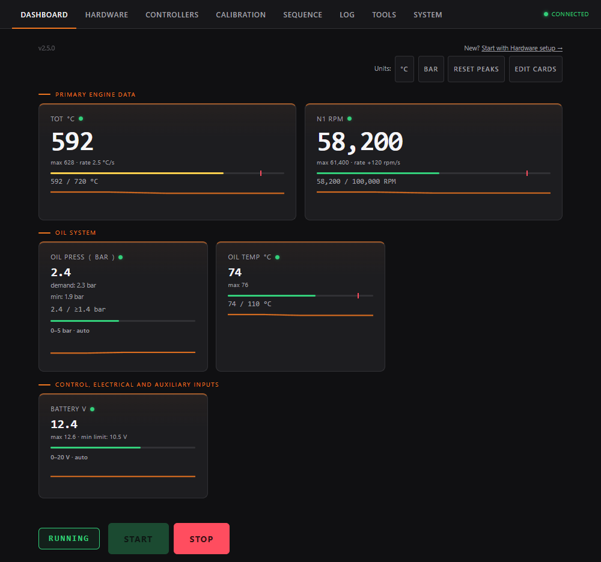

<h1 align="center">OpenTurbine</h1>

OpenTurbine 2.5.0 — open-source ESP32 turbine ECU with guided Windows setup and a browser-based dashboard.

  <a href="https://github.com/elia179/OpenTurbine-ESP32-Gas-Turbine-ECU/releases/latest/download/OpenTurbineSetupTool.exe"><strong>Download for Windows</strong></a>
  &middot; <a href="https://elia179.github.io/OpenTurbine-ESP32-Gas-Turbine-ECU/get-started/">Get Started</a>
  &middot; <a href="https://elia179.github.io/OpenTurbine-ESP32-Gas-Turbine-ECU/hardware/">Hardware guide</a>
  &middot; <a href="docs/README.md">Developer documentation</a>

## What is OpenTurbine?

OpenTurbine runs on supported ESP32 boards and hosts a browser interface for turbine configuration, monitoring and control. It is experimental, not certified.

The normal Windows installation does not require Git, PlatformIO, or source-code compilation.

### Current interface highlights

- Configure fitted sensors, switches and relay/PWM/servo outputs; optional PCB profiles use labelled ports instead of raw GPIOs.
- Use native inputs, SPI thermocouples, OneWire DS18B20 and discovered I²C devices, including NAU7802 load cells. See the [hardware guide](https://elia179.github.io/OpenTurbine-ESP32-Gas-Turbine-ECU/hardware/) for supported interfaces.
- Configure fuel and oil control, idle/governing, threshold controls and input-to-output mapping. Gradual limiting and hard shutdowns have separate settings.
- Build startup/shutdown sequences, calibrate signals and run bounded output tests before operating.
- Monitor readings, inspect event/run logs and back up the complete engine configuration.

Setup order: **Hardware → Controllers → System → Calibration → Sequence → Tools → Dashboard**. The [guided builds](https://elia179.github.io/OpenTurbine-ESP32-Gas-Turbine-ECU/guided-builds/) show wiring, configured cards and checks for each addition.

## What you need

- A Windows computer and data-capable USB cable
- A supported ESP32 board
- A browser-capable phone or computer for the dashboard
- Suitable driver electronics, sensors, power protection, and fusing
- A verified independent physical fuel/power stop and restrained test equipment

## Start with a new board

1. Connect a supported ESP32 board using a USB data cable.
2. [Download OpenTurbine Setup Tool](https://github.com/elia179/OpenTurbine-ESP32-Gas-Turbine-ECU/releases/latest/download/OpenTurbineSetupTool.exe).
3. Choose **Clean install / reinstall** for a blank board, or **Update and keep my setup** for a working controller.
4. For a clean install, choose **Development board**, a compatible bundled **Official OpenTurbine PCB**, or a chip-matched **Custom PCB profile** supplied with the PCB design.
5. Follow the Setup Tool, then join the board Wi-Fi and open the address it shows (normally `http://192.168.4.1`).

Keep only one OpenTurbine browser tab open at a time. This applies to both
Classic ESP32 and ESP32-S3 ECUs; close an old dashboard tab before opening the
panel in another tab, window, browser, phone, or computer.

If Windows warns about the Setup Tool, confirm that you used the official link above. Choose **More info → Run anyway** when Windows offers it. Do not disable Windows security or use an installer from another website. Normal installation does not require understanding or checking file hashes; [advanced verification](docs/WINDOWS_FLASHER_INSTALL.md#optional-advanced-checksum-verification) is optional.

## Supported targets

| Target | Status |
| --- | --- |
| Classic ESP32 with at least 4 MB flash | Supported |
| ESP32-S3 DevKitC-1-compatible board with at least 8 MB flash | Supported; the universal image runs on 8 MB and 16 MB modules without requiring PSRAM |
| Windows guided setup | Supported |
| macOS/Linux graphical installer | Not currently available |
| Manual source build | Advanced/developer path |
| Certified use | Not certified |

> **Experimental engine-control software:** Verify all limits, outputs, shutdown paths, and sequences on a restrained test setup. Use an independent physical fuel/power stop. OpenTurbine does not make an engine safe or replace suitable drivers, fusing, sensors, or operating judgment.

## Before introducing fuel

Configure only the hardware you actually fitted, then verify inputs, limits, calibration, sequences, and individual outputs with fuel and ignition made safe. Run complete dry sequences and verify every stop path before planning a controlled fueled test.

## Documentation

- [Public landing site](https://elia179.github.io/OpenTurbine-ESP32-Gas-Turbine-ECU/)
- [Get started](https://elia179.github.io/OpenTurbine-ESP32-Gas-Turbine-ECU/get-started/)
- [Hardware guide](https://elia179.github.io/OpenTurbine-ESP32-Gas-Turbine-ECU/hardware/)
- [User guide](https://elia179.github.io/OpenTurbine-ESP32-Gas-Turbine-ECU/user-guide/) ([source document](docs/USER_GUIDE.md))
- [Moving from a pre-2.0 build](docs/V2_MIGRATION.md)
- [Troubleshooting](https://elia179.github.io/OpenTurbine-ESP32-Gas-Turbine-ECU/troubleshooting/)
- [Safety](https://elia179.github.io/OpenTurbine-ESP32-Gas-Turbine-ECU/safety/)
- [Developer documentation](docs/README.md)
- [PCB profile authoring](pcb_profiles/README.md)

## Help and status

Use [Setup Help](https://github.com/elia179/OpenTurbine-ESP32-Gas-Turbine-ECU/issues/new?template=setup_help.yml) for Windows, installation, USB, Wi-Fi, and dashboard issues. Use [Bug reports](https://github.com/elia179/OpenTurbine-ESP32-Gas-Turbine-ECU/issues/new?template=bug_report.yml) only for reproducible software behavior, and [Discussions](https://github.com/elia179/OpenTurbine-ESP32-Gas-Turbine-ECU/discussions) for hardware and wiring questions.

OpenTurbine is experimental, not a certified engine-control system. Contributions are welcome; read the developer documentation before building source. Released under the [MIT License](LICENSE).
